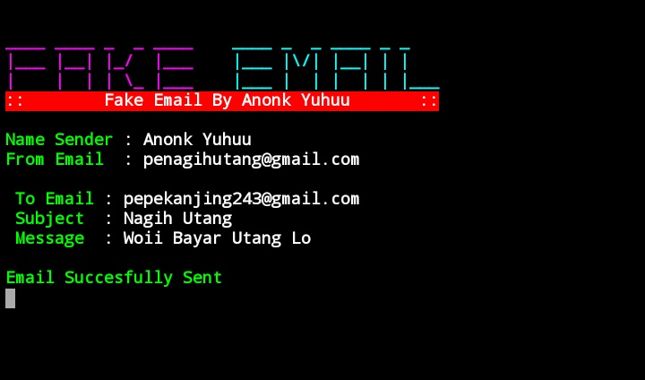

## Fake Email
* [Featurs](#featurs)
* [Instalation](#installation)
* [Chat Admin](#chat-admin)

## Featurs
* Custom Email
* Custom Name
* Custom Subject
* Custom Message
## Installation
```
$ apt-get update
$ apt install python
$ apt install git
$ pip install requests
$ python3 -m pip install requests
$ git clone https://github.com/anonkyuhuu/fake-email
$ cd fake-email
$ python3 main.py
```

## Chat Admin
Click [here](https://wa.me/62895611982226) To Chat Admin
